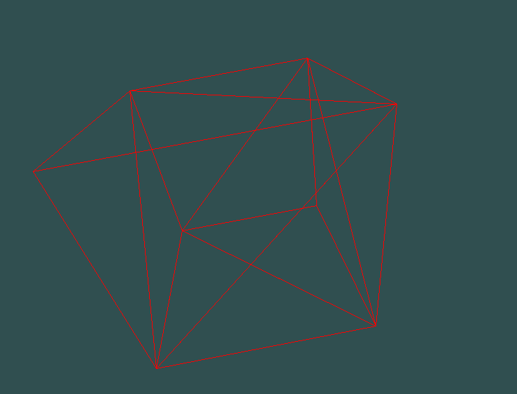

# Engine 3D



A simple 3D engine written in Python using Pygame (for learning purposes). This is a work in progress.

## Installation

```bash
git clone https://github.com/donaldnguyen99/engine3d.git
cd engine3d
```

It is recommended to use a virtual environment to install the dependencies.
Example using `venv`:
```bash
python -m venv env
source env/bin/activate
```

Example using `conda`:
```bash
conda create --name engine3d --file environment.yml
conda activate engine3d
```

Then run the following command to install the package in development mode or just install the package with `-e` flag:

```bash
pip install -e .
```

## Demo

To run the cube animation demo:

```bash
cd examples
python cube.py
```

To run the refraction demo, use the following command, then use A and D keys to move the incident ray.

```bash
cd examples
python refraction.py
```

